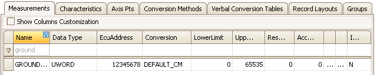

# A2L Item Area

Use the A2L item area in the ASAP2 Editor for viewing and editing items in an A2L file.  A2L files are used by MCD systems and test tools like Vehicle Spy to translate ECU serial data into user friendly displays and dialogs to help with calibration and diagnostic development.\
\
Before using the A2L item area it is recommended to verify the [Project Settings](../main-toolbar/asap2-tools/project-settings) in the [ASAP2 group](../main-toolbar/asap2-tools/) on the [main toolbar](../main-toolbar/).  The ASAP2 group also has tools for error checking, generating, and importing A2L files.\
\
The A2L item area contains tabs for different categories of items as shown in Figure 1.  Click the hyperlinks above Figure 1 to find more information for each tab.

[Measurements](measurements-tab) - [Characteristics ](characteristics-tab)- [Axis Pts](axis-pts-tab) - [Conversion Methods ](conversion-methods-tab)- [Verbal Conversion Tables ](verbal-conversion-tables-tab)- [Record Layouts](record-layouts-tab) - [Groups](groups-tab)

<figure>

<figcaption>Figure 1: Use the tabs in the A2L item area to view and edit items in A2L files.</figcaption>
</figure>

**Table Features Shared Across All Tabs**\
\
Every tab in the A2L item area shares useful features for working with their tables.\
\
Columns can be rearranged by dragging and dropping their headers within the table.  Columns can also be added and removed.  First, enable the **Show Columns Customization** checkbox to open a Hidden Columns window.  Next, drag and drop columns between the table and the Hidden Columns window areas.  Any columns dropped in the Hidden Columns window will be hidden after that window is closed.\
\
Columns can be filtered in two ways.  First, text can be typed in the cells of the first row in the table marked with a funnel icon to find items containing that text.  Second, if the mouse cursor hovers over a column header a **funnel button** will appear in the corner of the cell.  Click the funnel button to open a list of predefined filters ready for selection.\
\
Columns can be sorted A-Z and Z-A by clicking the column header.\
\
A convenient [right click menu](../a2l-item-area/a2l-item-right-click-menu) is available if the mouse is right clicked while the cursor is hovering over the table area.\
\
Item colors in the table indicate various conditions:\

* **Black** - item is ok.
* **Gray** - item does not exist in the ECU map file loaded in the [symbol tree](../main-toolbar/symbol-tree).
* **Orange** - item has some other warning or error condition.  Use the [Build All](../main-toolbar/asap2-tools/) tool on the main toolbar to quickly see the condition in the [Messages area](../messages-area).