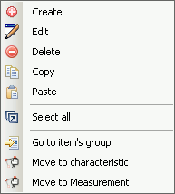

# A2L Item Right Click Menu

Editing tools are available in a right click menu while hovering the mouse cursor over the [A2L item area](/a2l-item-area).  Many of these tools can also be found in the [Edit group](../../main-toolbar/edit-tools/) of the [main toolbar](../../main-toolbar/).  Refer to Table 1 below for a brief description of each selection.

<figure>

<figcaption>Figure 1: The right click menu while hovering over the A2L item area.</figcaption>
</figure>

#### Table 1: A2L Item Right Click Menu Selections

| Menu Selection           | Description                                                                                                                                                                                                                                                                                                                                                                                                                                                                                                                                                                                                                                                                                                                                                                                       |
| ------------------------ | ------------------------------------------------------------------------------------------------------------------------------------------------------------------------------------------------------------------------------------------------------------------------------------------------------------------------------------------------------------------------------------------------------------------------------------------------------------------------------------------------------------------------------------------------------------------------------------------------------------------------------------------------------------------------------------------------------------------------------------------------------------------------------------------------- |
| Create                   | Open a dialog to create a new A2L file item.    <ul> <li>[Measurements](../../main-toolbar/edit-tools/create-edit-measurements)</li> <li>[Characteristics](../../main-toolbar/edit-tools/create-edit-characteristics)</li> <li>[Axis Pts](../../main-toolbar/edit-tools/create-edit-axis-pts)</li> <li>[Conversion Methods](../../main-toolbar/edit-tools/create-edit-conversion-methods)</li> <li>[Verbal Conversion Tables](../../main-toolbar/edit-tools/create-edit-verbal-conversion-tables)</li> <li>[Record Layouts](../../main-toolbar/edit-tools/create-edit-record-layouts)</li> <li>[Groups](../../main-toolbar/edit-tools/create-edit-groups)</li> </ul>                                                                                                                      |
| Edit\*                   | Open a dialog to edit highlighted A2L file items. The dialog layouts are the same as those used for the Create selection.                                                                                                                                                                                                                                                                                                                                                                                                                                                                                                                                                                                                                                                                         |
| Delete\*                 | Delete highlighted A2L file items.                                                                                                                                                                                                                                                                                                                                                                                                                                                                                                                                                                                                                                                                                                                                                                |
| Copy\*                   | Copy highlighted A2L file items to a copy buffer.                                                                                                                                                                                                                                                                                                                                                                                                                                                                                                                                                                                                                                                                                                                                                 |
| Paste                    | Paste A2L file items from the copy buffer to the end of the item list.                                                                                                                                                                                                                                                                                                                                                                                                                                                                                                                                                                                                                                                                                                                            |
| Select All               | Select all A2L file items on the current tab.                                                                                                                                                                                                                                                                                                                                                                                                                                                                                                                                                                                                                                                                                                                                                     |
| Go to Item's Group       | Go to the [Groups tab](../../a2l-item-area/groups-tab) and open the [edit Group dialog](../../main-toolbar/edit-tools/create-edit-groups) for the group the item is currently in.                                                                                                                                                                                                                                                                                                                                                                                                                                                                                                                                                                                                                                  |
| Move to Characteristic\* | Move highlighted A2L file items to the [Characteristics tab](../../a2l-item-area/characteristics-tab).                                                                                                                                                                                                                                                                                                                                                                                                                                                                                                                                                                                                                                                                                                             |
| Move to Measurement\*    | Move highlighted A2L file items to the [Measurements tab](../../a2l-item-area/measurements-tab).                                                                                                                                                                                                                                                                                                                                                                                                                                                                                                                                                                                                                                                                                                                   |

\*These menu selections can be applied to multiple A2L items at once to help save time. Just press and hold the keyboard Shift or Control keys while left clicking on items to highlight a group of items to change. Then right click and make a menu selection to apply it to all highlighted items at once.