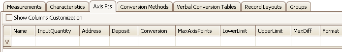

# Axis Pts Tab

Axis Pts define axes that are shared across multiple Characteristic curves or maps.  These axes have a Characteristic Axis Type = COM\_AXIS.\
\
The Axis Pts tab has a table to display all A2L file Axis Pt items and their properties.  Each row (below the 1st filtering row) defines an Axis and each column is a property.  The default column configuration is shown in Figure 1.

<figure>

<figcaption>Figure 1: The Axis Pts tab in the A2L file item area.</figcaption>
</figure>

Columns in the table can be filtered, reorganized, added, and hidden.  These [table features](/a2l-item-area) are common across all tabs in this area.\
\
To add items to the table you can:

* Drag/drop [symbols](../../main-toolbar/symbol-tree) from an ECU map file.
* Use the [Create](../../main-toolbar/edit-tools/) tool or [right click menu](../a2l-item-right-click-menu) selection.
* [Import](../../main-toolbar/asap2-tools/) an existing A2L file.

To edit items already in the table with the [Edit Axis Pts](../../main-toolbar/edit-tools/create-edit-axis-pts) dialog you can:

* Double click on a cell in the table.
* Use the [Edit tool](../../main-toolbar/edit-tools/) or [right click menu](../a2l-item-right-click-menu) selection.

Refer to Table 1 below for a description of each column on the Axis Pts tab.

#### Table 1: Column Descriptions for the Axis Pts Tab

| Default Columns | Description                                                                                                                                                                                                                                                                                                                                                                                                                                                                                                                                                                                                                                                                                                                                                        |
| --------------- | ------------------------------------------------------------------------------------------------------------------------------------------------------------------------------------------------------------------------------------------------------------------------------------------------------------------------------------------------------------------------------------------------------------------------------------------------------------------------------------------------------------------------------------------------------------------------------------------------------------------------------------------------------------------------------------------------------------------------------------------------------------------ |
| Name            | Unique identifier of the Axis Pts.  Here are the main requirements for this field:   <ul><li>Max overall length = 1024 characters.</li></ul><ul><li>Max partial string length = 128 characters.</li></ul><ul><li>Allowed characters: A - Z, a - z, 0 - 9, underscores, periods, and brackets [ ].</li></ul><ul><li>Must NOT contain spaces.</li></ul><ul><li>First character must be a letter or an underscore.</li></ul><ul><li>Any brackets must occur in pairs at the end of a partial string.</li></ul><ul><li>Any bracket pairs must surround a number or string.</li></ul><ul><li>Name is case sensitive. (i.e. "b" and "B" are considered unique)</li></ul>  If in doubt about valid names, please refer to the ASAM specifications. |
| InputQuantity   | References a Measurement to be used as a working point on the axis to track along the curve or map.  The dropdown selections come from the [Measurements tab](.././measurements-tab).                                                                                                                                                                                                                                                                                                                                                                                                                                                                                                                                                                                |
| Address         | Memory [Address](../../main-toolbar/edit-tools/edit-memory-address) of the Axis Pts in the ECU.                                                                                                                                                                                                                                                                                                                                                                                                                                                                                                                                                                                                                                                                    |
| Deposit         | Specifies the data structure.  The default layout will update depending upon the Data Type field.  The dropdown selections come from the [Record Layouts tab](../record-layouts-tab).  The Data Type over on the Record Layout tab must match the Data Type field on this dialog.                                                                                                                                                                                                                                                                                                                                                                                                                                                                                  |
| Conversion      | Applies the selected Conversion Method to the value.  The dropdown selections come from the [Conversion Methods tab](../../a2l-item-area/conversion-methods-tab).                                                                                                                                                                                                                                                                                                                                                                                                                                                                                                                                                                                                                   |
| MaxAxisPoints   | Maximum number of axis points.                                                                                                                                                                                                                                                                                                                                                                                                                                                                                                                                                                                                                                                                                                                                     |
| LowerLimit      | Lower limit of plausible range of values.  A default limit is determined mathematically by the Data Type selection.  Note: The default limit is reapplied each time the Data Type is changed.                                                                                                                                                                                                                                                                                                                                                                                                                                                                                                                                                         |
| UpperLimit      | Upper limit of plausible range of values.  A default limit is determined mathematically by the Data Type selection.  Note: The default limit is reapplied each time the Data Type is changed.                                                                                                                                                                                                                                                                                                                                                                                                                                                                                                                                                         |
| MaxDiff         | Maximum adjustment allowed to an axis point.  Entered as an absolute value, not as a percentage.                                                                                                                                                                                                                                                                                                                                                                                                                                                                                                                                                                                                                                                                   |
| Format          | Display formatting applied to numerical values.  If specified, this Format property overrides any formatting in the Conversion Method property.  The syntax for this field is: %Length.Layout  <ul><li>Length = overall length</li></ul><ul><li>Layout = number of decimal places</li></ul>                                                                                                                                                                                                                                                                                                                                                                                                                                                         |

| Hidden Columns     | Description                                                                                                                                                                                                                                                                                                                                                                                                                                                                                                                                                                                                                                                                                                                                                                            |
| ------------------ | -------------------------------------------------------------------------------------------------------------------------------------------------------------------------------------------------------------------------------------------------------------------------------------------------------------------------------------------------------------------------------------------------------------------------------------------------------------------------------------------------------------------------------------------------------------------------------------------------------------------------------------------------------------------------------------------------------------------------------------------------------------------------------------- |
| CalibrationAccess  | There are 4 types of access for MCD systems or test tools:  <ul><li>CALIBRATION - read and write allowed.</li></ul><ul><li>NO_CALIBRATION - read only.</li></ul><ul><li>NOT_IN_MCD_SYSTEM - read and write not allowed, for internal ECU use only.</li></ul><ul><li>OFFLINE_CALIBRATION - read allowed, write only allowed offline.</li></ul>                                                                                                                                                                                                                                                                                                                                                                                                                                     |
| DataType           | Determines the number of bytes dedicated to the value and how those bytes are interpreted.  This property should be chosen early because it applies defaults to the Lower/Upper Limit and Extended Lower/Upper Limit properties.  <ul><li>UBYTE - 1 byte unsigned integer</li></ul><ul><li>SBYTE - 1 byte signed integer</li></ul><ul><li>UWORD - 2 byte unsigned integer</li></ul><ul><li>SWORD - 2 byte signed integer</li></ul><ul><li>ULONG - 4 byte unsigned integer</li></ul><ul><li>SLONG - 4 byte signed integer</li></ul><ul><li>FLOAT32_IEEE - 4 byte (32 bit) floating point IEEE format</li></ul><ul><li>FLOAT64_IEEE - 8 byte (64 bit) floating point IEEE format</li></ul><ul><li>FLOAT32_TASKING - 4 byte (32 bit) floating point tasking format</li></ul> |
| DisplayIdentifier  | An alternative display name that is usually much shorter than the Name property.  Can be useful for devices with small display areas.                                                                                                                                                                                                                                                                                                                                                                                                                                                                                                                                                                                                                                                  |
| ExtendedLowerLimit | Extends the lower limit of plausible values.  Can be useful for generating warnings when the Lower Limit is exceeded.  A default limit is determined mathematically by the Data Type selection.  Note: The default limit is reapplied each time the Data Type is changed.                                                                                                                                                                                                                                                                                                                                                                                                                                                                                                 |
| ExtendedUpperLimit | Extends the upper limit of plausible values.  Can be useful for generating warnings when the Upper Limit is exceeded.  A default limit is determined mathematically by the Data Type selection.  Note: The default limit is reapplied each time the Data Type is changed.                                                                                                                                                                                                                                                                                                                                                                                                                                                                                                 |
| KeyName            | Name from a map file [symbol](../../main-toolbar/symbol-tree) dropped into the A2L item area.                                                                                                                                                                                                                                                                                                                                                                                                                                                                                                                                                                                                                                                                                          |
| LongIdentifier     | Comment or description.                                                                                                                                                                                                                                                                                                                                                                                                                                                                                                                                                                                                                                                                                                                                                                |
| Manual Flag        | Manual flag setting from the [Address tab](../../main-toolbar/edit-tools/edit-memory-address) on the Axis Pts' edit dialog.                                                                                                                                                                                                                                                                                                                                                                                                                                                                                                                                                                                                                                                            |