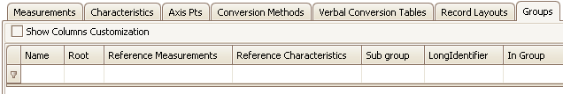

# Groups Tab

Use Groups in an A2L file to help organize [Measurements](../measurements-tab) and [Characteristics](../characteristics-tab) into logical categories.\
\
The Groups tab has a table to display all A2L file Groups and their properties.  Each row (below the 1st filtering row) defines a Group and each column is a property.  The default column configuration is shown in Figure 1.

<figure>

<figcaption>Figure 1: The Groups tab in the A2L file item area.</figcaption>
</figure>

Columns in the table can be filtered, reorganized, added, and hidden.  These [table features](../../a2l-item-area) are common across all tabs in this area.\
\
To add items to the table you can:

* Use the [Create](../../main-toolbar/edit-tools/) tool or [right click menu](../a2l-item-right-click-menu) selection.
* [Import](../../main-toolbar/asap2-tools/) an existing A2L file.

To edit items already in the table with the [Edit Groups](../../main-toolbar/edit-tools/create-edit-groups) dialog you can:

* Double click on a cell in the table.
* Use the [Edit](../../main-toolbar/edit-tools/) tool or [right click menu](../a2l-item-right-click-menu) selection.

Refer to Table 1 below for a description of each column on the Groups tab.

#### Table 1: Column Descriptions for the Groups Tab

| Default Columns           | Description                                                                                                                                                                                                                                                                                                                                                                                                                                                                                                                                                                                                                                                                                                                                                     |
| ------------------------- | --------------------------------------------------------------------------------------------------------------------------------------------------------------------------------------------------------------------------------------------------------------------------------------------------------------------------------------------------------------------------------------------------------------------------------------------------------------------------------------------------------------------------------------------------------------------------------------------------------------------------------------------------------------------------------------------------------------------------------------------------------------- |
| Name                      | Unique identifier of the Group.  Here are the main requirements for this field:  <ul><li>Max overall length = 1024 characters.</li></ul><ul><li>Max partial string length = 128 characters.</li></ul><ul><li>Allowed characters: A - Z, a - z, 0 - 9, underscores, periods, and brackets [ ].</li></ul><ul><li>Must NOT contain spaces.</li></ul><ul><li>First character must be a letter or an underscore.</li></ul><ul><li>Any brackets must occur in pairs at the end of a partial string.</li></ul><ul><li>Any bracket pairs must surround a number or string.</li></ul><ul><li>Name is case sensitive. (i.e. "b" and "B" are considered unique)</li></ul>  If in doubt about valid names, please refer to the ASAM specifications. |
| Root                      | Yes/No flag showing if this Group is at the Root level.                                                                                                                                                                                                                                                                                                                                                                                                                                                                                                                                                                                                                                                                                                         |
| Reference Measurements    | List of Measurements currently in this Group.                                                                                                                                                                                                                                                                                                                                                                                                                                                                                                                                                                                                                                                                                                                   |
| Reference Characteristics | List of Characteristics currently in this Group.                                                                                                                                                                                                                                                                                                                                                                                                                                                                                                                                                                                                                                                                                                                |
| Sub Group                 | List of Subgroups that belong to this group.                                                                                                                                                                                                                                                                                                                                                                                                                                                                                                                                                                                                                                                                                                                    |
| LongIdentifier            | Comment or description.                                                                                                                                                                                                                                                                                                                                                                                                                                                                                                                                                                                                                                                                                                                                         |
| In Group                  | Yes/No flag showing if this Group is in another group.                                                                                                                                                                                                                                                                                                                                                                                                                                                                                                                                                                                                                                                                                                          |