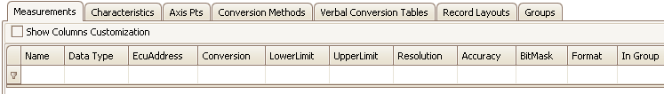

# Measurements Tab

Measurements are typically read-only values stored in an ECU.

The Measurements tab has a table to display all A2L file Measurement items and their properties. Each row (below the 1st filtering row) defines a Measurement and each column is a property. The default column configuration is shown in Figure 1.

<figure>

<figcaption>Figure 1: The Measurements tab in the A2L file item area..</figcaption>
</figure>

Columns in the table can be filtered, reorganized, added, and hidden.  These [table features](/a2l-item-area) are common across all tabs in this area.\
\
To add items to the table you can:

* Drag/drop [symbols](../../main-toolbar/symbol-tree) from an ECU map file.
* Use the [Create](../../main-toolbar/edit-tools/) tool or [right click menu](../a2l-item-right-click-menu) selection.
* [Import](../../main-toolbar/asap2-tools/) an existing A2L file.

To edit items already in the table with the [Edit Measurement](../../main-toolbar/edit-tools/create-edit-measurements) dialog you can:

* Double click on a cell in the table.
* Use the [Edit](../../main-toolbar/edit-tools/) tool or [right click menu](../a2l-item-right-click-menu) selection.

Refer to Table 1 below for a description of each column on the Measurements tab.

#### Table 1: Column Descriptions for the Measurements Tab

| Default Columns | Description                                                                                                                                                                                                                                                                                                                                                                                                                                                                                                                                                                                                                                                                                                     |
|-----------------|-----------------------------------------------------------------------------------------------------------------------------------------------------------------------------------------------------------------------------------------------------------------------------------------------------------------------------------------------------------------------------------------------------------------------------------------------------------------------------------------------------------------------------------------------------------------------------------------------------------------------------------------------------------------------------------------------------------------|
| Name            | Unique identifier of the Measurement.    Here are the main requirements for this field:    <ul><li>Max overall length = 1024 characters.</li><li>Max partial string length = 128 characters.</li><li>Allowed characters: A - Z, a - z, 0 - 9, underscores, periods, and brackets [ ].</li><li>Must NOT contain spaces.</li><li>First character must be a letter or an underscore.</li><li>Any brackets must occur in pairs at the end of a partial string.</li><li>Any bracket pairs must surround a number or string.</li><li>Name is case sensitive. (i.e. "b" and "B" are considered unique)</li></ul>   If in doubt about valid names, please refer to the ASAM specifications.     |
| Data Type       | Determines the number of bytes dedicated to the value and how those bytes are interpreted.  This property should be chosen early because it applies defaults to the Bit Mask, Lower Limit, and Upper Limit properties.   <ul><li>UBYTE - 1 byte unsigned integer</li><li>SBYTE - 1 byte signed integer</li><li>UWORD - 2 byte unsigned integer</li><li>SWORD - 2 byte signed integer</li><li>ULONG - 4 byte unsigned integer</li><li>SLONG - 4 byte signed integer</li><li>FLOAT32_IEEE - 4 byte (32 bit) floating point IEEE format</li><li>FLOAT64_IEEE - 8 byte (64 bit) floating point IEEE format</li><li>FLOAT32_TASKING - 4 byte (32 bit) floating point tasking format</li></ul>                |
| ECUAddress      | Memory [Address](../../main-toolbar/edit-tools/edit-memory-address) of the Measurement in the ECU.                                                                                                                                                                                                                                                                                                                                                                                                                                                                                                                                                                                                              |
| Conversion      | Applies the selected Conversion Method to the value.  The dropdown selections come from the [Conversion Methods tab](../../a2l-item-area/conversion-methods-tab).                                                                                                                                                                                                                                                                                                                                                                                                                                                                                                                                                   |
| LowerLimit      | Lower limit of plausible range of values.  A default limit is determined mathematically by the Data Type selection.Note: The default limit is reapplied each time the Data Type is changed.                                                                                                                                                                                                                                                                                                                                                                                                                                                                                                                     |
| UpperLimit      | Upper limit of plausible range of values.  A default limit is determined mathematically by the Data Type selection.Note: The default limit is reapplied each time the Data Type is changed.                                                                                                                                                                                                                                                                                                                                                                                                                                                                                                                     |
| Resolution      | Smallest possible change in bits. (0 to 255)                                                                                                                                                                                                                                                                                                                                                                                                                                                                                                                                                                                                                                                                    |
| Accuracy        | Possible variation from exact value in %.                                                                                                                                                                                                                                                                                                                                                                                                                                                                                                                                                                                                                                                                       |
| BitMask         | Masks out single bits of the value to be processed.  0xFF = no mask for that byte.  This property defaults to no masking with the number of 0xFF's determined by the Data Type selection.Note: The default mask is reapplied each time the Data Type is changed.                                                                                                                                                                                                                                                                                                                                                                                                                                                |
| Format          | Display formatting applied to numerical values.  If specified, this Format property overrides any formatting in the Conversion property.    The syntax for this field is: %Length.Layout <ul><li>Length = overall length</li> <li>Layout = number of decimal places </li></ul>                                                                                                                                                                                                                                                                                                                                                                                                                          |
| In Group        | The [Group](../../a2l-item-area/groups-tab) this item is in.                                                                                                                                                                                                                                                                                                                                                                                                                                                                                                                                                                                                                                                        |

| Hidden Columns    | Description                                                                                                                           |
| ----------------- | ------------------------------------------------------------------------------------------------------------------------------------- |
| DisplayIdentifier | An alternative display name that is usually much shorter than the Name property.  Can be useful for devices with small display areas. |
| KeyName           | Name from a map file [symbol](../../main-toolbar/symbol-tree) dropped into the A2L item area.                                            |
| LongIdentifier    | Comment or description.                                                                                                               |
| Manual Flag       | Manual flag setting from the [Address tab](../../main-toolbar/edit-tools/edit-memory-address) on the Measurement's edit dialog.          |