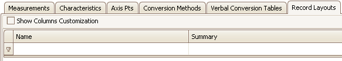

# Record Layouts Tab

Record Layouts specify data structures in the ECU memory.

The Record Layouts tab (Figure 1) has a table to display all A2L file Record Layouts. Each row (below the 1st filtering row) defines a Record Layout.

<figure>

<figcaption>Figure 1: The Record Layouts tab in the A2L file item area.</figcaption>
</figure>

Columns in the table can be filtered, reorganized, added, and hidden.  These [table features](../../a2l-item-area) are common across all tabs in this area.\
\
To add items to the table you can:

* Use the [Create](../../main-toolbar/edit-tools/) tool or [right click menu](../a2l-item-right-click-menu) selection.
* [Import](../../main-toolbar/asap2-tools/) an existing A2L file.

To edit items already in the table with the [Edit Record Layouts](../../main-toolbar/edit-tools/create-edit-record-layouts) dialog you can:

* Double click on a cell in the table.
* Use the [Edit](../../main-toolbar/edit-tools/) tool or [right click menu](../a2l-item-right-click-menu) selection.