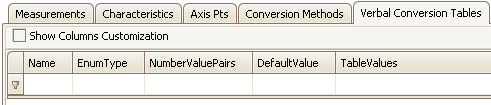

# Verbal Conversion Tables Tab

Verbal Conversion Tables are equivalent to enumerated or state encoded decimal lookup tables. These tables take integer value inputs and apply text description outputs to them. For example, 0 = Off, 1 = On, etc.

The Verbal Conversion Tables tab has a table to display all A2L file Verbal Conversion Tables and their properties. Each row (below the 1st filtering row) defines a Verbal Conversion Table and each column is a property. The default column configuration is shown in Figure 1.

<figure>

<figcaption>Figure 1: The Verbal Conversion Tables tab in the A2L file item area.</figcaption>
</figure>

Columns in the table can be filtered, reorganized, added, and hidden.  These [table features](/a2l-item-area) are common across all tabs in this area.\
\
To add items to the table you can:

* Drag/drop [symbols](../../main-toolbar/symbol-tree) from an ECU map file.
* Use the [Create](../../main-toolbar/edit-tools/) tool or [right click menu](../a2l-item-right-click-menu) selection.
* [Import](../../main-toolbar/asap2-tools/) an existing A2L file.

To edit items already in the table with the [Edit Verbal Conversion Tables](../../main-toolbar/edit-tools/create-edit-verbal-conversion-tables) dialog you can:

* Double click on a cell in the table.
* Use the [Edit](../../main-toolbar/edit-tools/) tool or [right click menu](../a2l-item-right-click-menu) selection.

Refer to Table 1 below for a description of each column on the Verbal Conversion Tables tab

#### Table 1: Column Descriptions for the Verbal Conversion Tables Tab

| Default Columns  | Description                                                                                                                                                                                                                                                                                                                                                                                                                                                                                                                                                                                                                                                                                                                                                                       |
| ---------------- | --------------------------------------------------------------------------------------------------------------------------------------------------------------------------------------------------------------------------------------------------------------------------------------------------------------------------------------------------------------------------------------------------------------------------------------------------------------------------------------------------------------------------------------------------------------------------------------------------------------------------------------------------------------------------------------------------------------------------------------------------------------------------------- |
| Name             | Unique identifier of the Verbal Conversion Table.  Here are the main requirements for this field:  <ul><li>Max overall length = 1024 characters.</li></ul><ul><li>Max partial string length = 128 characters.</li></ul><ul><li>Allowed characters: A - Z, a - z, 0 - 9, underscores, periods, and brackets [ ].</li></ul><ul><li>Must NOT contain spaces.</li></ul><ul><li>First character must be a letter or an underscore.</li></ul><ul><li>Any brackets must occur in pairs at the end of a partial string.</li></ul><ul><li>Any bracket pairs must surround a number or string.</li></ul><ul><li>Name is case sensitive. (i.e. "b" and "B" are considered unique)</li></ul>  If in doubt about valid names, please refer to the ASAM specifications. |
| EnumType         | Mislabeled column that works like KeyName which is the name from a map file [symbol](../../main-toolbar/symbol-tree) dropped into the A2L item area.                                                                                                                                                                                                                                                                                                                                                                                                                                                                                                                                                                                                                              |
| NumberValuePairs | Total number of defined Input/Output pairs.                                                                                                                                                                                                                                                                                                                                                                                                                                                                                                                                                                                                                                                                                                                                       |
| DefaultValue     | Default text display for undeclared Inputs.                                                                                                                                                                                                                                                                                                                                                                                                                                                                                                                                                                                                                                                                                                                                       |
| TableValues      | List of each defined Input/Output pair.                                                                                                                                                                                                                                                                                                                                                                                                                                                                                                                                                                                                                                                                                                                                           |

| Hidden Columns | Description             |
| -------------- | ----------------------- |
| LongIdentifier | Comment or description. |