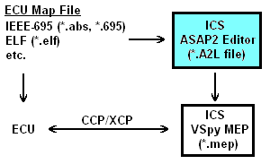

# ASAP2 Editor Help Documentation

This documentation describes the features of the ICS ASAP2 Editor software application.

**Overview** (refer to Figure 1)

Various map file formats generated from source code compilation define symbols in an ECU's memory.  The ICS ASAP2 Editor converts map files into ASAM standard A2L files that define ECU measurements, calibrations, and diagnostic information.  The A2L files are used by the ICS Vehicle Spy MEP feature to translate CCP/XCP message traffic with the ECU into user friendly displays and dialogs that aid calibration and diagnostic development.

<figure>

<figcaption>Figure 1: Overview of how the ASAP2 Editor supports Vehicle Spy and ECUs that use CCP/XCP</figcaption>
</figure>

**General Layout and Use** (refer to Figure 2)

The ASAP2 Editor consists of a [main toolbar](./main-toolbar) along the top of the window and three viewing areas. 

A common way to use the editor is to first load an ECU map file and see its symbols in a +/- tree in the [Symbol area](./main-toolbar/symbol-tree)  .  The symbols can then be added to an A2L file by dragging and dropping them onto the tabs in the [A2L item area](./a2l-item-area)  .  The [Messages area](./messages-area)  will display any warnings or errors after building or generating the A2L file.

Another way to use the editor is to simply import previously created A2L files, edit their contents in the A2L item area, and generate the modified A2L file.

<figure>

<figcaption>Figure 2: General layout of the ASAP2 Editor</figcaption>
</figure>

The Symbols and Messages areas  & 
can be redocked into other locations within the editor by dragging and dropping their titlebars. These areas can also be pinned to the sides of the editor to disappear as named tabs when not in use and reappear when the mouse is hovered over the tab.

**Acronyms**

Some abbreviations coming from specifications are used in the ASAP2 Editor and these helpfiles.  Here's a short list of descriptions to help understand the acronyms being used:

* A2L - file extension on files using the ASAM MCD-2MC metalanguage.
* A2ML - another name for the ASAM MCD-2MC metalanguage.
* ASAM - Association for Standardization of Automation and Measuring Systems. (www.asam.net)
* ASAM MCD-2MC - metalanguage used in all A2L files.
* ASAP2 - from German Arbeitskreis zur Standardisierung von Applikationssystemen.  Older acronym replaced by ASAM MCD-2MC.
* CCP - CAN Calibration Protocol.
* ECU - Electronic Control Unit.
* ICS - Intrepid Control Systems. ([www.intrepidcs.com](http://intrepidcs.com/))
* MCD - Measurement, Calibration, and Diagnostics.
* MEP - Memory Edit Protocol, a feature in Vehicle Spy from ICS.
* VSpy - Vehicle Spy, an MCD system from ICS.
* XCP - Universal Calibration Protocol.

### **Contact Information & Useful Links**

[ICS Contact Information](https://www.intrepidcs.com/worldwide/)

On the web:

* [Basic Training Video](http://intrepidcs.com/support/video_vspy3_videos.htm#atwolb)  
* [Advanced Training Video](http://intrepidcs.com/support/video_vspy3_videos.htm#atwola)  
* [ASAM Standards](http://www.asam.net)