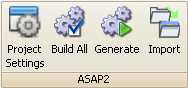

# ASAP2 Tools

The ASAP2 group (Figure 1) in the [main toolbar](/main-toolbar) contains tools to adjust A2L file properties and generate or import A2L files.  Refer to Table 1 for a brief description of each selection.

<figure>

<figcaption>Figure 1: The ASAP2 toolbar group.</figcaption>
</figure>

#### Table 1: ASAP2 Tools

| **ASAP2 Tool**                         | **Hotkey** | **Description**                                                                                                                                                                                                           |
|----------------------------------------|------------|---------------------------------------------------------------------------------------------------------------------------------------------------------------------------------------------------------------------------|
| [Project Settings](./project-settings) | Ctrl\+P    | Open dialog to edit the A2L file properties\.                                                                                                                                                                             |
| Build All                              | Ctrl\+B    | Build an A2L file based upon the current project, but do NOT save results to an A2L file\.  Useful for quick error checking in the [Messages area](/messages-area)\.                                                      |
| Generate                               | Ctrl\+G    | Build an A2L file based upon the current project and save results to an A2L file name of your choice\.  Errors in the [Messages area](/messages-area) will prevent the A2L file from being saved, but warnings will not\. |
| Import                                 | Ctrl\+I    | Import an A2L file into the current project\.                                                                                                                                                           |
