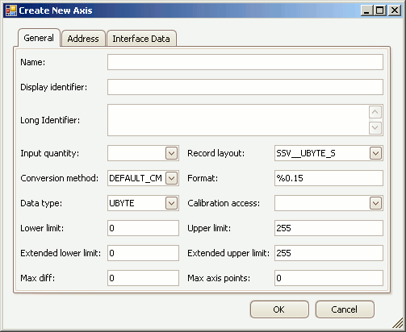

# Create/Edit Axis Pts

Axis Pts define axes that are shared across multiple Characteristic curves or maps.  These axes have a [Characteristic Axis Type](../create-edit-characteristics/edit-characteristic-axes/#table-1-characteristic-properties-on-the-x-axis-and-y-axis-tabs) = COM\_AXIS.\
\
To create or edit Axis Pts in an A2L file use the [Create or Edit tools](../../edit-tools) in the main toolbar or the [right click menu](../../../a2l-item-area/a2l-item-right-click-menu) while the [Axis Pts tab](../../../a2l-item-area/axis-pts-tab) is active in the A2L file area.  A tabbed dialog will open similar to that shown in Figure 1.

<figure>

<figcaption>Figure 1: The dialog for creating or editing A2L file Axis Pts.</figcaption>
</figure>

The General tab defines most of the Axis Pts properties and these are described in Table 1 below.  The [Address tab](../edit-memory-address) defines memory addressing for the Axis Pts.  The [Interface Data tab](../edit-interface-data) supports unique data that a tool may need to run properly.  Use the OK button to close the dialog and save any changes.  Use the Cancel button to close the dialog without saving any changes.

#### Table 1: Axis Pts Properties on the General Tab

| **Property**         | **Description**                                                                                                                                                                                                                                                                                                                                                                                                                                                                                                                                                                                                                                                                                                              |
|----------------------|------------------------------------------------------------------------------------------------------------------------------------------------------------------------------------------------------------------------------------------------------------------------------------------------------------------------------------------------------------------------------------------------------------------------------------------------------------------------------------------------------------------------------------------------------------------------------------------------------------------------------------------------------------------------------------------------------------------------------|
| Name                 | Unique identifier of the Axis Pts\.   Here are the main requirements for this field:     <ul><li>Max overall length = 1024 characters\.</li><li>Max partial string length = 128 characters\.</li><li>Allowed characters: A \- Z, a \- z, 0 \- 9, underscores, periods, and brackets \[ \]\.</li><li>Must NOT contain spaces\.</li><li>First character must be a letter or an underscore\.</li><li>Any brackets must occur in pairs at the end of a partial string\.</li><li>Any bracket pairs must surround a number or string\.</li><li>Name is case sensitive\. \(i\.e\. "b" and "B" are considered unique\)</li></ul> If in doubt about valid names, please refer to the ASAM specifications\.        |
| Display Identifier   | An alternative display name that is usually much shorter than the Name property\.  Can be useful for devices with small display areas\.                                                                                                                                                                                                                                                                                                                                                                                                                                                                                                                                                                                      |
| Long Identifier      | Comment or description\.                                                                                                                                                                                                                                                                                                                                                                                                                                                                                                                                                                                                                                                                                                     |
| Input Quantity       | References a Measurement to be used as a working point on the axis to track along the curve or map\.  The dropdown selections come from the [Measurements tab](../../../a2l-item-area/measurements-tab)\.                                                                                                                                                                                                                                                                                                                                                                                                                                                                                                                    |
| Record Layout        | Specifies the data structure\.  The default layout will update depending upon the Data Type field\.  The dropdown selections come from the [Record Layouts tab](../../../a2l-item-area/record-layouts-tab)\.  The Data Type over on the Record Layout tab must match the Data Type field on this dialog\.                                                                                                                                                                                                                                                                                                                                                                                                                    |
| Conversion Method    | Applies the selected Conversion Method to the value\.  The dropdown selections come from the [Conversion Methods tab](../../../a2l-item-area/conversion-methods-tab)\.                                                                                                                                                                                                                                                                                                                                                                                                                                                                                                                                                       |
| Format               | Display formatting applied to numerical values\.  If specified, this Format property overrides any formatting in the Conversion Method property\.  The syntax for this field is: %Length\.Layout<ul><li>Length = overall length</li><li>Layout = number of decimal places</li></ul>                                                                                                                                                                                                                                                                                                                                                                                                                                  |
| Data Type            | Determines the number of bytes dedicated to the value and how those bytes are interpreted\.  This property should be chosen early because it applies defaults to the Lower/Upper Limit and Extended Lower/Upper Limit properties\.   <ul><li>UBYTE - 1 byte unsigned integer</li><li>SBYTE - 1 byte signed integer</li><li>UWORD - 2 byte unsigned integer</li><li>SWORD - 2 byte signed integer</li><li>ULONG - 4 byte unsigned integer</li><li>SLONG - 4 byte signed integer</li><li>FLOAT32_IEEE - 4 byte (32 bit) floating point IEEE format</li><li>FLOAT64_IEEE - 8 byte (64 bit) floating point IEEE format</li><li>FLOAT32_TASKING - 4 byte (32 bit) floating point tasking format</li></ul>                 |
| Calibration Access   | There are 4 types of access for MCD systems or test tools:  <ul><li>CALIBRATION - read and write allowed.</li><li>NO_CALIBRATION - read only.</li><li>NOT_IN_MCD_SYSTEM - read and write not allowed, for internal ECU use only.</li><li>OFFLINE_CALIBRATION - read allowed, write only allowed offline.</li></ul>                                                                                                                                                                                                                                                                                                                                                                                                   |
| Lower Limit          | Lower limit of plausible range of values\.  A default limit is determined mathematically by the Data Type selection\.  Note: The default limit is reapplied each time the Data Type is changed\.                                                                                                                                                                                                                                                                                                                                                                                                                                                                                                                     |
| Upper Limit          | Upper limit of plausible range of values\.  A default limit is determined mathematically by the Data Type selection\.  Note: The default limit is reapplied each time the Data Type is changed\.                                                                                                                                                                                                                                                                                                                                                                                                                                                                                                                     |
| Extended Lower Limit | Extends the lower limit of plausible values\.  Can be useful for generating warnings when the Lower Limit is exceeded\.  A default limit is determined mathematically by the Data Type selection\.  Note: The default limit is reapplied each time the Data Type is changed\.                                                                                                                                                                                                                                                                                                                                                                                                                                        |
| Extended Upper Limit | Extends the upper limit of plausible values\.  Can be useful for generating warnings when the Upper Limit is exceeded\.  A default limit is determined mathematically by the Data Type selection\.  Note: The default limit is reapplied each time the Data Type is changed\.                                                                                                                                                                                                                                                                                                                                                                                                                                        |
| Max Diff             | Maximum adjustment allowed to an axis point\.  Entered as an absolute value, not as a percentage\.                                                                                                                                                                                                                                                                                                                                                                                                                                                                                                                                                                                                                           |
| Max Axis Points      | Maximum number of axis points\.                                                                                                                                                                                                                                                                                                                                                                                                                                                                                                                                                                                                                                                                                              |
