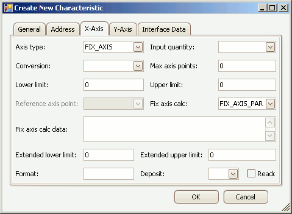

# Edit Characteristic Axes

To create or edit Characteristics in an A2L file use the [Create or Edit tools](../../../edit-tools) in the main toolbar or the [right click menu](../../../../a2l-item-area/a2l-item-right-click-menu) while the [Characteristics tab](../../../../a2l-item-area/characteristics-tab) is active in the A2L file area.  A tabbed dialog will open similar to that shown in Figure 1.

<figure>

<figcaption>Figure 1: The dialog for editing a Characteristic axis.</figcaption>
</figure>

The X-Axis tab in this dialog is available if the [Characteristic Type](../../create-edit-characteristics/#table-1-characteristic-properties-on-the-general-tab) is a curve because a curve is an array of values with 1 axis.  Both the X and Y-Axis tabs are shown if the Characteristic type is a map because a map is a table of values with 2 axes.  The properties on the X and Y-Axis tabs are identical and described below in Table 1.\
\
The [General tab](../../create-edit-characteristics/) defines the Characteristic type and most of the other properties.  The [Address tab](../../edit-memory-address) defines memory addressing for the Characteristic.  The [Interface Data tab](../../edit-interface-data) supports unique data that a tool may need to run properly.  Use the OK button to close the dialog and save any changes.  Use the Cancel button to close the dialog without saving any changes.

#### Table 1: Characteristic Properties on the X-Axis and Y-Axis Tabs

| **Property**         | **Description**                                                                                                                                                                                                                                                                                                                                                                                                                                                                                                                                                                                                          |
|----------------------|--------------------------------------------------------------------------------------------------------------------------------------------------------------------------------------------------------------------------------------------------------------------------------------------------------------------------------------------------------------------------------------------------------------------------------------------------------------------------------------------------------------------------------------------------------------------------------------------------------------------------|
| Axis Type            | The ASAP2 Editor supports 3 axis types:    <ul><li>FIX\_AXIS \- These axis points are "fixed" in the sense that they can not be written by an MCD system or test tool\.  Axis points are calculated using the Fix Axis Calc and Fix Axis Calc Data properties\.</li></ul>   <ul><li>STD\_AXIS \- Standard axis where the axis points are stored in the ECU and writeable by a test tool\.</li></ul>   <ul><li>COM\_AXIS \- Common axis that can be applied to multiple curves and maps\. Use the Reference Axis Point property to pick the [Axis Pts](../../../../a2l-item-area/axis-pts-tab).</li></ul> |
| Input Quantity       | References a Measurement to be used as a working point on the axis to track along the curve or map\.  The dropdown selections come from the [Measurements tab](../../../../a2l-item-area/measurements-tab).                                                                                                                                                                                                                                                                                                                                                                                                              |
| Conversion           | Applies the selected Conversion Method to the axis values\.  The dropdown selections come from the [Conversion Methods tab](../../../../a2l-item-area/conversion-methods-tab).                                                                                                                                                                                                                                                                                                                                                                                                                                                     |
| Max Axis Points      | Maximum number of axis points\.                                                                                                                                                                                                                                                                                                                                                                                                                                                                                                                                                                                          |
| Lower Limit          | Lower limit of plausible range of values\.                                                                                                                                                                                                                                                                                                                                                                                                                                                                                                                                                                               |
| Upper Limit          | Upper limit of plausible range of values\.                                                                                                                                                                                                                                                                                                                                                                                                                                                                                                                                                                               |
| Reference Axis Point | Selects the Axis Pts record if the Axis Type = COM\_AXIS\.  The dropdown selections come from the [Axis Pts tab](../../../../a2l-item-area/axis-pts-tab).                                                                                                                                                                                                                                                                                                                                                                                                                                                                          |
| Fix Axis Calc        | Selects how points are created for Axis Type = FIX\_AXIS\.   <ul><li>FIX\_AXIS\_PAR \- uses equation X\(i\) = Offset \+ \(i\-1\)\*2^Shift, where i = \{1\.\.\.\# of axis points\}\.</li></ul> <ul><li>FIX\_AXIS\_PAR\_DIST \- uses equation X\(i\) = Offset \+ \(i\-1\)\*Distance, where i = \{1\.\.\.\# of axis points\}\.</li></ul> <ul><li>FIX\_AXIS\_PAR\_LIST \- uses a list of values\.  The Conversion property is applied to achieve the actual display values.</li></ul>                                                                                                                        |
| Fix Axis Calc Data   | Input values for the Fix Axis Calc property\.   <ul><li>FIX\_AXIS\_PAR format is: Offset, Shift, \# of axis points\.Example: 0, 4, 6 creates axis points: 0, 16, 32, 48, 64, 80\.</li></ul> <ul><li>FIX\_AXIS\_PAR\_DIST format is: Offset, Distance, \# of axis points\.Example: 1, 10, 5 creates axis points: 1, 11, 21, 31, 41\.</li></ul>  <ul><li>FIX\_AXIS\_PAR\_LIST format is just a list of numbers separated with commas.</li></ul>                                                                                                                                                            |
| Extended Lower Limit | Extends the lower limit of plausible values\.  Can be useful for generating warnings when the Lower Limit is exceeded\.                                                                                                                                                                                                                                                                                                                                                                                                                                                                                                  |
| Extended Upper Limit | Extends the upper limit of plausible values\.  Can be useful for generating warnings when the Upper Limit is exceeded\.                                                                                                                                                                                                                                                                                                                                                                                                                                                                                                  |
| Format               | Display formatting applied to numerical values\.  If specified, this Format property overrides any formatting in the Conversion property\.   The syntax for this field is: %Length\.Layout    <ul><li>Length = overall length</li> <li>Layout = number of decimal places</li></ul>                                                                                                                                                                                                                                                                                                                       |
| Deposit              | Determines how axis points are stored in ECU memory:   <ul><li>ABSOLUTE \- value is stored as an absolute value\.</li> <li>DIFFERENCE \- value is stored as the difference from the preceding value\.</li></ul>                                                                                                                                                                                                                                                                                                                                                                                                  |
| Readonly checkbox    | If enabled, axis points will be read\-only and can not be written\.                                                                                                                                                                                                                                                                                                                                                                                                                                                                                                                                                      |