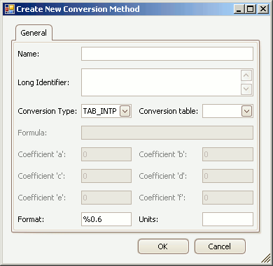

# Create/Edit Conversion Methods

Conversion Methods are formulas and tables applied to [Measurements](../../../a2l-item-area/measurements-tab), [Characteristics](../../../a2l-item-area/characteristics-tab), and [Axis Pts](../../../a2l-item-area/axis-pts-tab).  They are declared with the keyword COMPU\_METHOD within the A2L file.\
\
To create or edit Conversion Methods in an A2L file use the Create or Edit tools from the [Edit group](/main-toolbar/edit-tools) in the [main toolbar](/main-toolbar) while the [Conversion Methods tab](../../../a2l-item-area/conversion-methods-tab) is active in the A2L file area.  A dialog will open similar to that shown in Figure 1.

<figure>

<figcaption>Figure 1: The dialog for creating or editing A2L file Conversion Methods.</figcaption>
</figure>

Refer to Table 1 below for a brief description of each property.  Use the OK button to close the dialog and save any changes.  Use the Cancel button to close the dialog without saving any changes.

#### Table 1: Conversion Method Properties

| **Property**                | **Description**                                                                                                                                                                                                                                                                                                                                                                                                                                                                                                                                                                                                                                                                                                                   |
|-----------------------------|-----------------------------------------------------------------------------------------------------------------------------------------------------------------------------------------------------------------------------------------------------------------------------------------------------------------------------------------------------------------------------------------------------------------------------------------------------------------------------------------------------------------------------------------------------------------------------------------------------------------------------------------------------------------------------------------------------------------------------------|
| Name                        | Unique identifier of the Conversion Method.     Here are the main requirements for this field:    <ul><li>Max overall length = 1024 characters.</li><li>Max partial string length = 128 characters.</li><li>Allowed characters: A - Z, a - z, 0 - 9, underscores, periods, and brackets [ ].</li><li>Must NOT contain spaces.</li><li>First character must be a letter or an underscore.</li><li>Any brackets must occur in pairs at the end of a partial string.</li><li>Any bracket pairs must surround a number or string.</li><li>Name is case sensitive. (i.e. "b" and "B" are considered unique)</li></ul> If in doubt about valid names, please refer to the ASAM specifications.                    |
| Long Identifier             | Comment or description.                                                                                                                                                                                                                                                                                                                                                                                                                                                                                                                                                                                                                                                                                                           |
| Conversion Type             | The ASAP2 Editor supports 5 types of conversions:    <ul><li>TAB_INTP - table with interpolation.</li><li>TAB_NOINTP - table without interpolation.</li><li>TAB_VERB - verbal conversion table.</li><li>RAT_FUNC - fractional rational function f(x)=(axx + bx + c)/(dxx + ex + f), where coefficients 'a' through 'f' are specified properties.</li><li>FORM - formula as specified in the Formula property.</li></ul>                                                                                                                                                                                                                                                                                                        |
| Conversion Table            | Table used for the TAB_x conversion types.  Dropdown selections come from the [Verbal Conversion Tables tab](../../../a2l-item-area/verbal-conversion-tables-tab).                                                                                                                                                                                                                                                                                                                                                                                                                                                                                                                                                                                                                       |
| Formula                     | Formula specified as a function of x.    Multiple references use syntax X1, X2, X3, etc where X1 references the first input, X2 the second, etc.  If there is only one reference in the formula then X can be used instead of X1.                                                                                                                                                                                                                                                                                                                                                                                                                                                                                                    |
| Coefficients'a' through 'f' | Coefficient values for the Conversion Type = RAT_FUNC.f(x)=(axx + bx + c)/(dxx + ex + f)                                                                                                                                                                                                                                                                                                                                                                                                                                                                                                                                                                                                                                          |
| Format                      | Display formatting applied to numerical values.  This Format will be overridden by any Format properties specific to [Measurements](.././create-edit-measurements), [Characteristics](.././create-edit-characteristics), and [Axis Pts](.././create-edit-axis-pts).    The syntax for this field is: %Length.Layout     <ul><li>Length = overall length</li><li>Layout = number of decimal places</li></ul>                                                          |
| Units                       | A physical unit label like Volts, RPM, kph, etc.                                                                                                                                                                                                                                                                                                                                                                                                                                                                                                                                                                                                                                                                                  |
