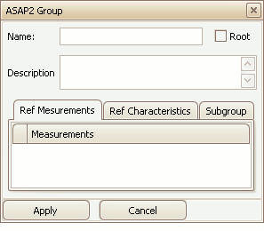

# Create/Edit Groups

Use Groups in an A2L file to help organize [Measurements](../../../a2l-item-area/measurements-tab) and [Characteristics](../../../a2l-item-area/characteristics-tab) into logical categories.\
\
To create or edit Groups use the tools from the [Edit group](/main-toolbar/edit-tools) in the [main toolbar](/main-toolbar) or the [right click menu](../../../a2l-item-area/a2l-item-right-click-menu) while the [Groups tab](../../../a2l-item-area/groups-tab) is active in the A2L file area.  A dialog will open similar to Figure 1.

<figure>

<figcaption>Figure 1: The dialog for creating or editing A2L file Groups.</figcaption>
</figure>

The Group Name must follow the same rules that apply to all other A2L item names.  Enable the Root checkbox to force the Group to be at the root, or base level, of a branch.  Use the Description field to describe the group or enter a comment. \
\
Add items to the Group by dragging them from the [Measurements tab](../../../a2l-item-area/measurements-tab) or [Characteristics tab](../../../a2l-item-area/characteristics-tab) and dropping them onto the corresponding tab on the edit Group dialog.  Add Subgroups within the Group by dragging them from the Groups tab and dropping them onto the Subgroup tab.  Only Groups with their Root flag disabled can be used as a Subgroup.\
\
Use the Apply button to close the dialog and save any changes.  Use the Cancel button to close the dialog without saving any changes.