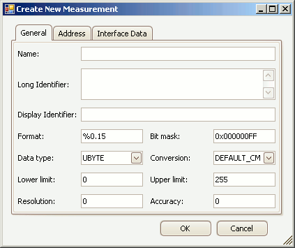

# Create/Edit Measurements

Measurements are typically read-only values stored in an ECU.\
\
To create or edit Measurements in an A2L file use the [Create or Edit tools](../../edit-tools) in the main toolbar or the [right click menu](../../../a2l-item-area/a2l-item-right-click-menu) while the [Measurements tab](../../../a2l-item-area/measurements-tab) is active in the A2L file area.  A tabbed dialog will open similar to that shown in Figure 1.

<figure>

<figcaption>Figure 1: The dialog for creating or editing A2L file Measurements.</figcaption>
</figure>

The General tab defines most of the Measurement properties and these are described in Table 1 below.  The [Address tab](../edit-memory-address) defines memory addressing for the Measurement.  The [Interface Data tab](../edit-interface-data) supports unique data that a tool may need to run properly.  Use the OK button to close the dialog and save any changes.  Use the Cancel button to close the dialog without saving any changes.

#### Table 1: Measurement Properties on the General Tab

| **Property**       | **Description**                                                                                                                                                                                                                                                                                                                                                                                                                                                                                                                                                                                                                                                                                              |
|--------------------|--------------------------------------------------------------------------------------------------------------------------------------------------------------------------------------------------------------------------------------------------------------------------------------------------------------------------------------------------------------------------------------------------------------------------------------------------------------------------------------------------------------------------------------------------------------------------------------------------------------------------------------------------------------------------------------------------------------|
| Name               | Unique identifier of the Measurement\.    Here are the main requirements for this field:    • Max overall length = 1024 characters\.  • Max partial string length = 128 characters\.  • Allowed characters: A \- Z, a \- z, 0 \- 9, underscores, periods, and brackets \[ \]\.  • Must NOT contain spaces\.  • First character must be a letter or an underscore\.  • Any brackets must occur in pairs at the end of a partial string\.  • Any bracket pairs must surround a number or string\.  • Name is case sensitive\. \(i\.e\. "b" and "B" are considered unique\)   If in doubt about valid names, please refer to the ASAM specifications\.      |
| Long Identifier    | Comment or description\.                                                                                                                                                                                                                                                                                                                                                                                                                                                                                                                                                                                                                                                                                     |
| Display Identifier | An alternative display name that is usually much shorter than the Name property\.  Can be useful for devices with small display areas\.                                                                                                                                                                                                                                                                                                                                                                                                                                                                                                                                                                      |
| Format             | Display formatting applied to numerical values\.  If specified, this Format property overrides any formatting in the Conversion property\.     The syntax for this field is: %Length\.Layout   • Length = overall length   • Layout = number of decimal places                                                                                                                                                                                                                                                                                                                                                                                                                               |
| Bit Mask           | Masks out single bits of the value to be processed\.  0xFF = no mask for that byte\.  This property defaults to no masking with the number of 0xFF's determined by the Data Type selection\.Note: The default mask is reapplied each time the Data Type is changed\.                                                                                                                                                                                                                                                                                                                                                                                                                                         |
| Data Type          | Determines the number of bytes dedicated to the value and how those bytes are interpreted\.  This property should be chosen early because it applies defaults to the Bit Mask, Lower Limit, and Upper Limit properties\.   • UBYTE \- 1 byte unsigned integer   • SBYTE \- 1 byte signed integer   • UWORD \- 2 byte unsigned integer   • SWORD \- 2 byte signed integer   • ULONG \- 4 byte unsigned integer   • SLONG \- 4 byte signed integer   • FLOAT32\_IEEE \- 4 byte \(32 bit\) floating point IEEE format   • FLOAT64\_IEEE \- 8 byte \(64 bit\) floating point IEEE format   • FLOAT32\_TASKING \- 4 byte \(32 bit\) floating point tasking format             |
| Conversion         | Applies the selected Conversion Method to the value\.  The dropdown selections come from the [Conversion Methods tab](../../../a2l-item-area/conversion-methods-tab)\.                                                                                                                                                                                                                                                                                                                                                                                                                                                                                                                                       |
| Lower Limit        | Lower limit of plausible range of values\.  A default limit is determined mathematically by the Data Type selection\.Note: The default limit is reapplied each time the Data Type is changed\.                                                                                                                                                                                                                                                                                                                                                                                                                                                                                                               |
| Upper Limit        | Upper limit of plausible range of values\.  A default limit is determined mathematically by the Data Type selection\.Note: The default limit is reapplied each time the Data Type is changed\.                                                                                                                                                                                                                                                                                                                                                                                                                                                                                                               |
| Resolution         | Smallest possible change in bits\. \(0 to 255\)                                                                                                                                                                                                                                                                                                                                                                                                                                                                                                                                                                                                                                                              |
| Accuracy           | Possible variation from exact value in %\.                                                                                                                                                                                                                                                                                                                                                                                                                                                                                                                                                                                                                                                                   |
