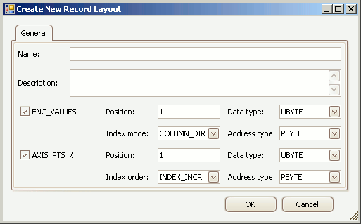

# Create/Edit Record Layouts

Record Layouts specify data structures in the ECU memory.\
\
To create or edit Record Layouts in an A2L file use the Create or Edit tools from the [Edit group](/main-toolbar/edit-tools) in the [main toolbar](/main-toolbar) while the [Record Layouts tab](../../../a2l-item-area/record-layouts-tab) is active in the A2L file area.  A dialog will open similar to that shown in Figure 1.

<figure>

<figcaption>Figure 1: The dialog for creating or editing A2L file Record Layouts.</figcaption>
</figure>

Refer to Table 1 below for a brief description of each property. Use the OK button to close the dialog and save any changes. Use the Cancel button to close the dialog without saving any changes.

#### Table 1: Record Layout Properties

| Property      | Description                                                                                                                                                                                                                                                                                                                                                                                                                                                                                                                                                                                                                                                                                                                                                                                                                                                                                                                                                                                                                                                                                                                                                                                                                                                                                                                                                                                                                                                                                                                                                                                   |
| ------------- | --------------------------------------------------------------------------------------------------------------------------------------------------------------------------------------------------------------------------------------------------------------------------------------------------------------------------------------------------------------------------------------------------------------------------------------------------------------------------------------------------------------------------------------------------------------------------------------------------------------------------------------------------------------------------------------------------------------------------------------------------------------------------------------------------------------------------------------------------------------------------------------------------------------------------------------------------------------------------------------------------------------------------------------------------------------------------------------------------------------------------------------------------------------------------------------------------------------------------------------------------------------------------------------------------------------------------------------------------------------------------------------------------------------------------------------------------------------------------------------------------------------------------------------------------------------------------------------------- |
| Name          | Unique identifier of the Record Layout.   Here are the main requirements for this field:    <ul><li>Max overall length = 1024 characters.</li></ul><ul><li>Max partial string length = 128 characters.</li></ul><ul><li>Allowed characters: A - Z, a - z, 0 - 9, underscores, periods, and brackets [ ].</li></ul><ul><li>Must NOT contain spaces.</li></ul><ul><li>First character must be a letter or an underscore.</li></ul><ul><li>Any brackets must occur in pairs at the end of a partial string.</li></ul><ul><li>Any bracket pairs must surround a number or string.</li></ul><ul><li>Name is case sensitive. (i.e. "b" and "B" are considered unique)</li></ul> If in doubt about valid names, please refer to the ASAM specifications.                                                                                                                                                                                                                                                                                                                                                                                                                                                                                                                                                                                                                                                                                                                                                                                                                                 |
| Description   | Comment or description.                                                                                                                                                                                                                                                                                                                                                                                                                                                                                                                                                                                                                                                                                                                                                                                                                                                                                                                                                                                                                                                                                                                                                                                                                                                                                                                                                                                                                                                                                                                                                                       |
| FNC\_VALUES   | If enabled, the Record Layout uses enabled properties to define how values are deposited in ECU memory.                                                                                                                                                                                                                                                                                                                                                                                                                                                                                                                                                                                                                                                                                                                                                                                                                                                                                                                                                                                                                                                                                                                                                                                                                                                                                                                                                                                                                                                                                       |
|  Position     | Start position of values in the record.  If the Index Mode uses one of the Alternate options the position determines the ordering of values and axis points.                                                                                                                                                                                                                                                                                                                                                                                                                                                                                                                                                                                                                                                                                                                                                                                                                                                                                                                                                                                                                                                                                                                                                                                                                                                                                                                                                                                                                                  |
|  Data Type    | Number of bytes dedicated to each value and how those bytes are interpreted.  <ul><li>UBYTE - 1 byte unsigned integer</li></ul><ul><li>SBYTE - 1 byte signed integer</li></ul><ul><li>UWORD - 2 byte unsigned integer</li></ul><ul><li>SWORD - 2 byte signed integer</li></ul><ul><li>ULONG - 4 byte unsigned integer</li></ul><ul><li>SLONG - 4 byte signed integer</li></ul><ul><li>FLOAT32_IEEE - 4 byte (32 bit) floating point IEEE format</li></ul><ul><li>FLOAT64_IEEE - 8 byte (64 bit) floating point IEEE format</li></ul>                                                                                                                                                                                                                                                                                                                                                                                                                                                                                                                                                                                                                                                                                                                                                                                                                                                                                                                                                                                                                                                  |
|  Index Mode   | Determines how the values of curves (arrays) or maps (tables) are stored in ECU memory.  For example consider these 2 curves, a map, and an X-Axis:        a1   a2   a3 == Example of curve a.       b1   b2   b3 == Example of curve b with common X-axis.  Y1  <strong>a11 a12 a13</strong> == Example of map a with Y-Axis points. Y2  <strong>a21 a22 a23</strong>        X1   X2   X3 == X-Axis points common to examples above.  <ul><li>COLUMN_DIR - store values by column.  Applying this mode gives:   Curve 'a' (a1, a2, a3)   Map 'a' (a11, a21, a12, a22, a13, a23)</li></ul>  <ul><li>ROW_DIR - store values by row.  Applying this mode gives:   Curve 'a' (a1, a2, a3)   Map 'a' (a11, a12, a13, a21, a22, a23)</li></ul>  <ul><li>ALTERNATE_WITH_X - store by alternating between column values and X-axis point.  Applying this mode gives:   Curve 'a' (a1, X1, a2, X2, a3, X3)   Map 'a' (a11, a21, X1, a12, a22, X2, a13, a23, X3)</li></ul>  <ul><li>ALTERNATE_WITH_Y - store by alternating between row values and Y-axis point.  Applying this mode gives:   Curve 'a' (not applicable)   Map 'a' (a11, a12, a13, Y1, a21, a22, a23, Y2)</li></ul>  <ul><li>ALTERNATE_CURVES - used for multiple curves with a common axis.  Store by alternating between column values from each curve and the common X-axis point.  Applying this mode gives:   Curves 'a' and 'b' (a1, b1, X1, a2, b2, X2, a3, b3, X3)</li></ul>   Map (not allowed)               |
|  Address Type | There are 4 types of memory addressing:<ul><li>PBYTE - memory location has a 1 byte pointer to the value.</li></ul><ul><li>PWORD - memory location has a 2 byte pointer to the value.</li></ul><ul><li>PLONG - memory location has a 4 byte pointer to the value.</li></ul><ul><li>DIRECT - memory location has the first value and remaining values follow with incrementing address.</li></ul>                                                                                                                                                                                                                                                                                                                                                                                                                                                                                                                                                                                                                                                                                                                                                                                                                                                                                                                                                                                                                                                                                                                                                                                              |
| AXIS\_PTS\_X  | If enabled, the Record Layout defines how X-axis points are deposited in ECU memory.                                                                                                                                                                                                                                                                                                                                                                                                                                                                                                                                                                                                                                                                                                                                                                                                                                                                                                                                                                                                                                                                                                                                                                                                                                                                                                                                                                                                                                                                                                          |
|  Position     | Same description as above for the FNC\_VALUES Position.                                                                                                                                                                                                                                                                                                                                                                                                                                                                                                                                                                                                                                                                                                                                                                                                                                                                                                                                                                                                                                                                                                                                                                                                                                                                                                                                                                                                                                                                                                                                       |
|  Data Type    | Same description as above for the FNC\_VALUES Data Type.                                                                                                                                                                                                                                                                                                                                                                                                                                                                                                                                                                                                                                                                                                                                                                                                                                                                                                                                                                                                                                                                                                                                                                                                                                                                                                                                                                                                                                                                                                                                      |
|  Index Order  | Determines the axis point sequence in the memory. <ul><li>INDEX_INCR - increasing index with increasing address.</li></ul><ul><li>INDEX_DECR - decreasing index with increasing address.</li></ul>                                                                                                                                                                                                                                                                                                                                                                                                                                                                                                                                                                                                                                                                                                                                                                                                                                                                                                                                                                                                                                                                                                                                                                                                                                                                                                                                                                                            |
|  Address Type | Same description as above for the FNC\_VALUES Address Type.                                                                                                                                                                                                                                                                                                                                                                                                                                                                                                                                                                                                                                                                                                                                                                                                                                                                                                                                                                                                                                                                                                                                                                                                                                                                                                                                                                                                                                                                                                                                   |