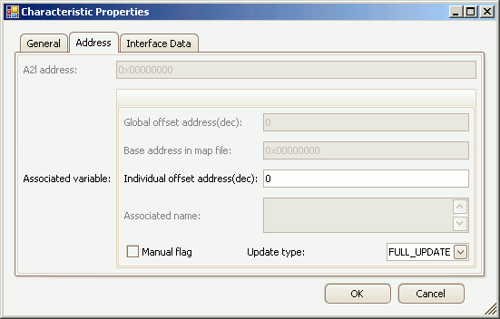

# Edit Memory Address

[Measurements](/main-toolbar/edit-tools/create-edit-measurements), [Characteristics](/main-toolbar/edit-tools/create-edit-characteristics), and [Axis Pts](/main-toolbar/edit-tools/create-edit-axis-pts) have memory addresses pointing to their location within an ECU.  The memory address can be changed by using the Address tab found in the edit dialogs for each of those A2L item types.  The Address tab will appear similar to Figure 1.

<figure>

<figcaption>Figure 1: Example of the dialog for editing a memory address.</figcaption>
</figure>

The Address tab properties are described in Table 1 below.  Use the OK button to close the dialog and save any changes.  Use the Cancel button to close the dialog without saving any changes.

#### Table 1: Address Tab Properties

|                           |                                                                                                                                                                                                                                                                                    |
| ------------------------- | ---------------------------------------------------------------------------------------------------------------------------------------------------------------------------------------------------------------------------------------------------------------------------------- |
| A2L Address               | Absolute memory address of the A2L item within the ECU.  Format is 4 bytes hexadecimal.  If the Manual Flag is enabled then this value can be entered directly.  If the Manual Flag is disabled then this value is calculated as Global Offset + Base Address + Individual Offset. |                                                                                                                                                                                                                                                                                   |
| Global Offset Address     | Offset value (decimal) added to the Base Address of all map file symbols dropped into the A2L item area.  The[ Project Settings](../../asap2-tools/project-settings) dialog is the only place to change this value.                                                                   |
| Base Address in Map File  | Memory address from a map file [symbol](../../symbol-tree) dropped into the A2L item area.  Format is 4 bytes hexadecimal.                                                                                                                                                            |
| Individual Offset Address | Offset value (decimal) added to the Base and Global Offset addresses.  This value can be changed only if the Manual Flag is disabled.                                                                                                                                              |
| Associated Name           | Name from a map file [symbol](../../symbol-tree) dropped into the A2L item area.                                                                                                                                                                                                      |
| Manual Flag               | Toggles how the A2L Address in this dialog is created.  Enable it to manually update the A2L Address directly.  Disable it to let the A2L address be calculated as Global Offset + Base Address + Individual Offset.                                                               |
| Update Type               | Applies only to Measurements and Characteristics.                                                                                                                                                                                                                                  |
