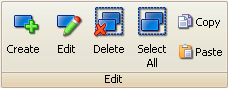

# Edit Tools

The Edit group (Figure 1) in the [main toolbar](/main-toolbar) has tools for editing [A2L items](../../a2l-item-area/).  These tools are also available in a convenient [right click menu](../../a2l-item-area/a2l-item-right-click-menu) while hovering the mouse cursor over the A2L item area.  Refer to Table 1 for a brief description of each selection.

<figure>

<figcaption>Figure 1: The Edit toolbar group.</figcaption>
</figure>

#### Table 1: Edit Tools

| **Edit Tool** | **Hotkey** | **Description**                                                                                                                                                                                                                                                                                                                                                                                                                                                      |
|---------------|------------|----------------------------------------------------------------------------------------------------------------------------------------------------------------------------------------------------------------------------------------------------------------------------------------------------------------------------------------------------------------------------------------------------------------------------------------------------------------------|
| Create        | Ctrl+C     | Open a dialog to create a new A2L file item.   <ul> <li>[Measurements](./create-edit-measurements)</li> <li>[Characteristics](./create-edit-characteristics)</li> <li>[Axis Pts](./create-edit-axis-pts)</li> <li>[Conversion Methods](./create-edit-conversion-methods)</li> <li>[Verbal Conversion Tables](./create-edit-verbal-conversion-tables)</li> <li>[Record Layouts](./create-edit-record-layouts)</li> <li>[Groups](create-edit-groups)</li></ul> |
| Edit*         | Ctrl+E     | Open a dialog to edit highlighted A2L file items. The dialog layouts are the same as those used for the Create tool.                                                                                                                                                                                                                                                                                                                                                 |
| Delete*       | Delete     | Delete highlighted A2L file items.                                                                                                                                                                                                                                                                                                                                                                                                                                   |
| Select All    | Ctrl+A     | Select all A2L file items on the current tab.                                                                                                                                                                                                                                                                                                                                                                                                                        |
| Copy*         | Ctrl+C     | Copy highlighted A2L file items to a copy buffer.                                                                                                                                                                                                                                                                                                                                                                                                                    |
| Paste         | Ctrl+V     | Paste A2L file items from the copy buffer to the end of the item list.                                                                                                                                                                                                                                                                                                                                                                                               |

\*The Edit, Delete, and Copy tools can be applied to multiple A2L items at once to help save time. Just press and hold the keyboard Shift or Control keys while left clicking on items to highlight a group of items to change. Then click on the tool to apply it to all highlighted items at once.