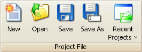

# Project File Tools

The Project File group (Figure 1) in the [main toolbar](/main-toolbar) contains tools for the ASAP2 Editor project files (\*.prj).  Refer to Table 1 for a brief description of each selection.

<figure>

<figcaption>Figure 1: The Project File toolbar group.</figcaption>
</figure>

#### Table 1: Project File Tools

| **Project File Tool** | **Hotkey**     | **Description**                                              |
|-----------------------|----------------|--------------------------------------------------------------|
| New                   | Ctrl\+N        | Create a blank project file\.                                |
| Open                  | Ctrl\+O        | Open an existing project file\.                              |
| Save                  | Ctrl\+S        | Save current setup to the currently open project file name\. |
| Save As               | Ctrl\+Shift\+S | Save current setup to a new project file name\.              |
| Recent Projects       | n/a            | Open one of the 10 most recently saved projects\.            |
