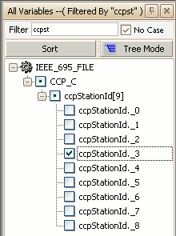
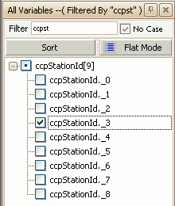

# Symbol Tree

Symbols are defined in ECU memory map files created by source code compilers.  These symbols are the main input to the ASAP2 Editor for making A2L files for applications like Vehicle Spy.\
\
To get all symbols from an ECU map file click the Load button found in the [Symbols group](../symbols-tools) on the [main toolbar](/main-toolbar).  When the file is loaded the symbols are displayed as a +/- tree in a docked window on the left side of the ASAP2 Editor.  This window can be redocked into other locations within the editor by dragging and dropping its titlebar.  The window can also be pinned  to the sides of the editor to disappear as a named tab when not in use and reappear when the mouse is hovered over the tab.

<figure>

<figcaption>Figure 1: Symbols in Tree Mode.</figcaption>
</figure>

 

<figure>

<figcaption>Figure 2: Symbols in Flat Mode.</figcaption>
</figure>

The symbol tree starts in **Tree Mode** (Figure 1) which means the root shows the ECU map file name and the main branches are the module names from the source code.  Click the +/- buttons in the tree to see the symbols in each of modules.  Click the Tree Mode button to toggle to **Flat Mode** (Figure 2) which displays the symbols without the ECU map file name or module names.\
\
Use the **Filter** entry to quickly find symbols.  Just type what you are looking for, tap the Enter key, and the tree is filtered to only show symbol names containing what you typed.  The **No Case** checkbox determines if the Filter is case sensitive.  The filter does not apply to the map file or module names seen in Tree Mode.\
\
Click the **Sort** button to sort the tree alphabetically A-Z, Z-A, or use the original sorting from the loaded map file.\
\
The symbol tree in Figures 1 and 2 shows an array and its elements.  Arrays are denoted with brackets \[ ] around a number at the end of their name.  The number is the number of elements within that array.  Each array element is denoted with the array name they belong to followed by an index number.  The element names can be replaced with more descriptive names by using the Enum Association tool in the [Symbols group](../symbols-tools) on the [main toolbar](/main-toolbar).\
\
To add a symbol to an A2L file, click on it then drag and drop it onto a valid tab in the [A2L file area](../../a2l-item-area/).  Symbols can not be dropped onto the Conversion Methods, Record Layouts, or Groups tabs.  Multiple symbols can be added at once to help save time.  Just press and hold the keyboard Shift or Control keys while left clicking to create a group of highlighted symbols.  Then drag and drop the entire group onto the desired tab.\
\
To the left of each symbol name is a status box.  A checkmark means the symbol is being used in the A2L file.  A dot means the module or array has a symbol in it being used in the A2L file.