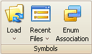
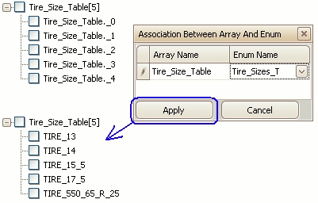

# Symbols Tools

The Symbols group (Figure 1) in the [main toolbar](/main-toolbar) contains tools for the [Symbol area](../symbol-tree) of the editor.  Refer to Table 1 for a brief description of each selection.

<figure>

<figcaption>Figure 1: The Symbols toolbar group.</figcaption>
</figure>

#### Table 1: Symbols Tools

| **Symbols Tool** | **Hotkey** | **Description**                                                                                                                                                                                                                                       |
|------------------|------------|-------------------------------------------------------------------------------------------------------------------------------------------------------------------------------------------------------------------------------------------------------|
| Load             | n/a        | Load all symbols from an ECU map file that is in one of these formats:   • IEEE\-695 \(\*\.abs or \*\.695\)   • ELF/DWARF \(\*\.elf\)   • TI COFF/DWARF \(\*\.out\)   • KEIL 166 \(\*\.m66\)   • OMF 166 \(\*\.omf\)              |
| Recent Files     | n/a        | Load one of the 10 most recently opened ECU map files\.                                                                                                                                                                                               |
| Enum Association | Ctrl\+L    | Open dialog to apply enumerated states to symbol arrays\.  Please read below for further details\.                                                                                                                                                    |

Elements within symbol arrays are initially displayed with generic names and index numbers like that shown in Figure 2. The Enum Association tool applies more descriptive names to the symbol array elements.

<figure>

<figcaption>Figure 2: Apply the Enum Association tool to get descriptive names for array elements.</figcaption>
</figure>

**To Apply Enumerated States to Symbol Arrays**:

1. Click the Enum Association tool button to open the dialog.
2. Drag and drop the array branch \[#] from the Symbols tree onto the dialog.
3. Click in the Enum Name cell and select the desired enumeration declaration.
4. Click the Apply button.

Use the Cancel button to restore all symbol array elements back to their generic names and index numbers.