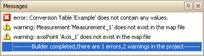

# Messages Area

The Messages area in the ASAP2 Editor displays any warnings or errors detected during the creation of an A2L file.  This area is displayed in a docked window on the bottom of the ASAP2 Editor.  The Messages window can be redocked into other locations within the editor by dragging and dropping its titlebar.  The window can also be pinned  to the sides of the editor to disappear as a named tab when not in use and reappear when the mouse is hovered over the tab.\
\
Using the **Build All** or **Generate** tools from the [ASAP2 group](/main-toolbar/asap2-tools) on the [main toolbar](/main-toolbar/) will update the Messages area.  Errors, warnings, and a build summary will appear similar to that shown in Figure 1.\
\
Any errors in the Messages area will prevent the A2L file from being saved, but warnings will not.

<figure>

<figcaption>Figure 1: Example of the Messages area in the ASAP2 Editor.</figcaption>
</figure>

